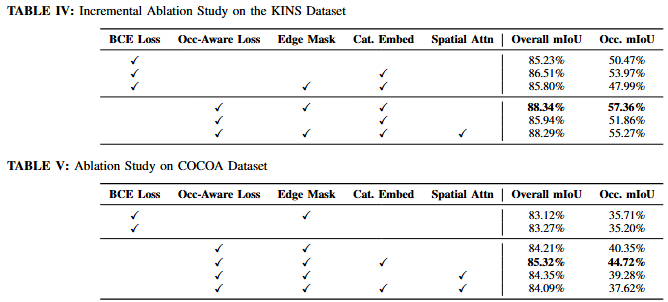

# 👁️ Amodal Shape Prediction (Swin-UNet + SAM 2.1)


Báo cáo dự án Nghiên cứu Khoa học / Đồ án chuyên ngành Khoa học Máy tính.
Dự án xây dựng mô hình phân đoạn **Amodal Mask**: dự đoán vùng vật thể đầy đủ ngay cả khi chúng bị lấp hoặc che khuất (occlusion) bởi các vật thể khác. 

Hệ thống được thiết kế theo dạng Pipeline 2 giai đoạn (2-Stage) kết hợp sức mạnh Zero-shot của **Segment Anything Model (SAM 2.1)** và khả năng học biểu diễn toàn cục của **Swin Transformer + U-Net**.


---

## 🌟 1. Tính năng & Mục tiêu cốt lõi
- **Tương tác trực quan:** Hỗ trợ click chuột (Point Prompt) trực tiếp trên ảnh để chọn vật thể. Hỗ trợ dự đoán cho 90 lớp vật thể chuẩn COCO.
- **Pipeline 2-Stage mạnh mẽ:**
  - *Stage 1 (Phân đoạn cục bộ):* Dùng `SAM 2.1` để trích xuất mặt nạ hiển thị (Visible Mask) từ điểm click.
  - *Stage 2 (Suy luận Amodal):* Dùng `Swin-UNet` phân tích đa kênh để dự đoán toàn bộ hình dáng vật thể.
- **Tính toán hình học:** Tự động đối chiếu Visible Mask và Amodal Mask để tính toán diện tích che khuất và hiển thị trực quan phần bị lấp.

## 🧠 2. Kiến trúc Mô hình (Amodal Swin-UNet)
Mô hình đã được nâng cấp lên cấu trúc 5-channel để tăng cường *Inductive Bias* cho mạng nơ-ron:

- **Encoder:** Sử dụng backbone `timm` (`swin_tiny_patch4_window7_224`, pretrained). Patch Embedding được can thiệp sửa đổi để nhận **Input Tensor [B, 5, 224, 224]** bao gồm:
  1. `Kênh 1-3:` Ảnh RGB (đã chuẩn hóa).
  2. `Kênh 4:` Visible Mask (phần vật thể không bị che khuất).
  3. `Kênh 5:` Edge Mask (ranh giới bị lấp, trích xuất bằng thuật toán hình thái học cv2.dilate/erode).
- **Category Embedding:** Chuyển đổi class ID của vật thể thành vector nhúng 768 chiều và cộng vào bottleneck của mạng U-Net để gợi ý đặc trưng phân loại của vật thể cho decoder.
- **Decoder:** Khối 3 cấp `UpBlock` kết hợp `nn.Upsample(scale_factor=4)`.
- **Head:** Lớp `Conv2d(64, 1, 1)` trả về logits. Kích thước output cuối cùng: `[B, 1, 224, 224]`.

> [!NOTE]
> Cấu hình chính của dự án sử dụng **Occ-Aware Loss + Edge Mask + Category Embedding = True** (không sử dụng Spatial Attention). Đây chính là cấu hình tại Hàng 4 (**Row 4**) trong bảng nghiên cứu thực nghiệm Ablation Study.

## 🗂️ 3. Dữ liệu & Tiền xử lý
- **Định dạng:** Tương tự COCOA format (`COCO_amodal_train2014.json`). Annotations chứa `regions`, `segmentation`, và `order`.
- **Logic xử lý (Dataset):**
  - Xóa phần bị che khuất dựa vào trường `order` (vật có order thấp hơn sẽ che vật cao hơn) để tạo Visible Mask mô phỏng.
  - Sử dụng `albumentations` để resize đồng bộ (Image + Mask) về `224x224`.

## 📂 4. Cấu trúc mã nguồn
Dự án được tổ chức như sau:

```text
.
├── app.py                  # Điểm khởi chạy giao diện tương tác (Gradio Web UI)
├── requirements.txt        # Các thư viện phụ thuộc của dự án
├── assets/                 # Hình ảnh minh họa (figures)
│   └── figures/            # Các biểu đồ và sơ đồ cấu trúc của dự án
├── checkpoints/            # Lưu trữ weights (sam2.1_b.pt, swin_amodal_epoch_30.pth)
├── data/                   # Thư mục chứa dữ liệu huấn luyện và validation (COCO-Amodal)
├── docs/                   # Tài liệu báo cáo, phân tích chiến lược occlusion
├── results/                # Kết quả đánh giá và đo đạc hiệu năng mô hình dưới dạng JSON/PNG
└── scripts/                # Các mã nguồn thực thi chính
    ├── model.py            # Định nghĩa mô hình Swin-UNet (Cấu hình chính - Row 4)
    ├── dataset.py          # Class xử lý dữ liệu và tiền xử lý ảnh đầu vào
    ├── train.py            # Huấn luyện mô hình với Occlusion-Aware Loss
    ├── evaluate.py         # Script đánh giá hiệu suất (Single-Image mIoU, Dice, Precision, Recall)
    ├── train_kins.ipynb    # Jupyter notebook huấn luyện trên tập dữ liệu KINS
    ├── README.md           # Hướng dẫn chi tiết về các cấu hình thực nghiệm (Ablation Study)
    └── other_config_cocoa/ # Các cấu hình thực nghiệm khác trong bảng Ablation Study (Row 1, 2, 3, 5, 6)
```

## 📊 5. Nghiên cứu Thực nghiệm (Ablation Study)
Dự án hỗ trợ 6 cấu hình mô hình thực nghiệm khác nhau tương ứng với bảng so sánh **Table V: Ablation Study on COCOA Dataset** (bao gồm các thay đổi về hàm Loss, Edge Mask, Category Embedding và Spatial Attention).

